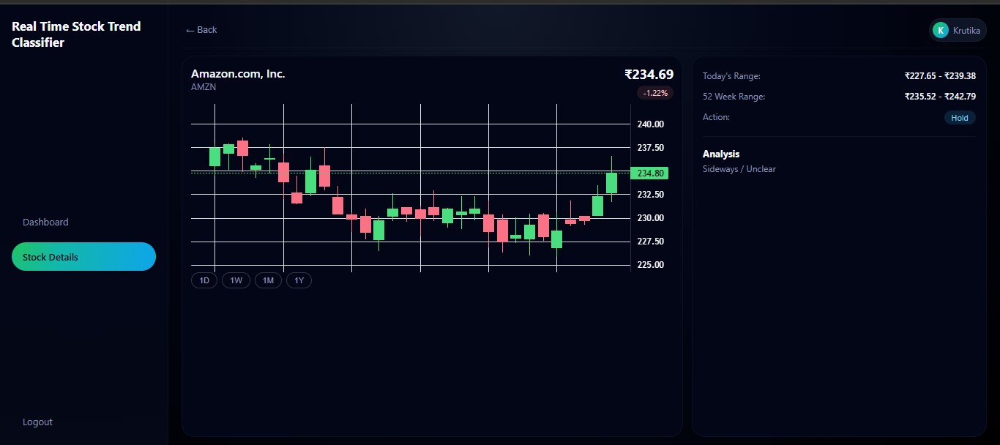

# Real-Time Stock Trend Classifier

This project is a cloud-based stock analysis dashboard built using AWS Amplify, AWS Lambda, API Gateway, and IAM.  
It tracks 20 global stocks, analyses short-term trends using simple technical indicators, and visualizes the results through a dashboard interface.

The goal of this project was to build a completely serverless, lightweight, and fast stock trend classifier without depending on heavy Python libraries.

---

## 📌 Project Description

The system collects 1-month stock data for 20 well-known companies using Yahoo Finance’s public chart API.  
The backend runs on AWS Lambda and generates short-term signals based on:

- Daily price change  
- SMA-5 (short moving average)  
- SMA-20 (long moving average)

Each stock is then classified as **Buy**, **Sell**, or **Hold**.  
The results are displayed on a cloud-hosted frontend built with HTML, CSS, and JavaScript.

The dashboard includes:
- A candlestick chart for the top-performing stock  
- Top 5 and Bottom 5 ranking lists  
- A searchable list of all 20 stocks  
- A detailed stock view with its own chart and analysis  

Everything runs completely serverless.

---

## 🛠️ How I Built It (Step-by-Step)

### **1. Backend – AWS Lambda**
- Initially, I planned to use the **yfinance** library.
- But yfinance is a large dependency and **Lambda rejected it due to size limits**.
- After multiple failed attempts, I learned that Yahoo Finance has a **public JSON chart API** that can be called directly using `urllib.request`.
- This removed the need for any heavy packages.
- I wrote a custom parser that:
  - Fetches OHLC data  
  - Converts it into a pandas DataFrame  
  - Calculates SMA-5, SMA-20, and daily change  
  - Generates the Buy/Sell/Hold signal  

The Lambda function returns clean JSON data to the frontend through API Gateway.

### **2. API Gateway**
- Created a REST API  
- Connected the Lambda function as the backend  
- Enabled CORS manually  
- Used IAM permissions for Lambda execution

### **3. Frontend**
- Built pages using HTML, CSS, and JavaScript
- Made fetch calls to the API Gateway endpoint
- Rendered:
  - Candlestick charts  
  - Ranking tables  
  - Stock cards  
  - Detailed view  
- Styled the UI to look modern, clean, and minimal

### **4. Hosting on AWS Amplify**
- Connected my GitHub repository  
- Amplify automatically built and deployed the frontend  
- The live site updates on every GitHub commit

---

## 🧩 Difficulties I Faced

### **❗ 1. yfinance being too large for Lambda**
This was the biggest challenge.  
I uploaded yfinance + dependencies repeatedly, but the deployment package kept exceeding Lambda’s size limit.

After a lot of searching, I discovered the **Yahoo Finance chart API URL**, which returns all the required stock data without any library.

This made my entire Lambda function lightweight and extremely fast.

### **❗ 2. CORS errors when calling the API**
API Gateway blocked frontend requests initially.  
I fixed this by:

- Enabling CORS in API Gateway  
- Adding CORS headers manually in the Lambda response  

### **❗ 3. Handling inconsistent API responses**
Some stocks returned missing OHLC values.  
I added proper `try/except` blocks and fallback logic to avoid breaking the UI.

---

## 🎯 What I Learned From This Project

- How to build a fully serverless backend using AWS Lambda  
- How API Gateway connects frontend and backend  
- How IAM roles affect Lambda execution  
- Using public financial APIs instead of heavy Python libraries  
- How to design dashboards and visualize data  
- How to host and manage frontend deployments using AWS Amplify  
- Practical debugging of CORS, JSON responses, and API failures  
- Structuring projects for cloud deployment  
- Importance of lightweight code in serverless environments  

This project reinforced real cloud engineering concepts while also improving my frontend and backend development skills.

---

## 🖼️ Screenshots

### **Landing Page**

### **Dashboard**

### **Stock Details Page**

---

## 📂 Project Structure
/frontend
1. index.html
2. dashboard.html
3. stock.html
4. script.js
5. styles.css

/backend
1. lambda_function.py

/screenshots
1. index.jpg
2. dashboard.jpg
3. stock.jpg

README.md

## 🚀 Deployment Summary

1. Created a Python Lambda function and added the backend logic  
2. Assigned an IAM role for Lambda  
3. Built a REST API in API Gateway and linked it to Lambda  
4. Enabled CORS  
5. Built the frontend interface and connected it to the REST API  
6. Deployed the frontend via AWS Amplify using GitHub integration  

---

## 👤 Author
Krutika Chaudhari

